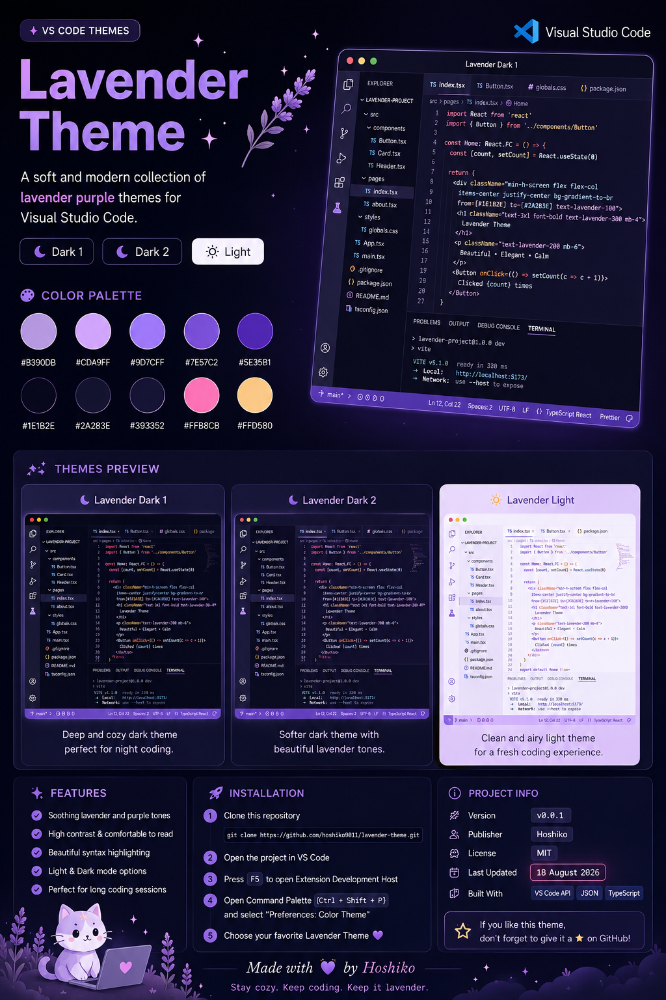

<p align="center">
  
</p>

<h1 align="center">💜 Lavender Theme for VS Code</h1>

<p align="center">
  A soft, dreamy collection of lavender purple themes for Visual Studio Code.
</p>
# 💜 Lavender Theme for VS Code !!

> A soft, dreamy purple theme for Visual Studio Code 💜✨

**Lavender Theme** is a purple-themed collection for VS Code, designed for developers who love cozy, clean, and aesthetic editor colors.

## 🎨 Themes

| Theme                    | Mode  | Style          |
| ------------------------ | ----- | -------------- |
| 🌌 Lavender Theme Dark 1 | Dark  | Deep & cozy    |
| 🌙 Lavender Theme Dark 2 | Dark  | Soft & dreamy  |
| ☁️ Lavender Theme Light  | Light | Clean & gentle |

## ✨ Features

* 💜 Beautiful lavender and purple color palette
* 🌙 Two dark themes
* ☀️ One light theme
* 🎀 Simple and aesthetic design
* 🧑‍💻 Made for Visual Studio Code

## 🚀 Installation

1. Clone this repository:

```bash
git clone https://github.com/hoshiko9011/lavender-theme.git
```

2. Open the project in **Visual Studio Code**.
3. Press `F5` to open the Extension Development Host.
4. Press `Ctrl + Shift + P`.
5. Search for **Preferences: Color Theme**.
6. Choose your favorite **Lavender Theme** 💜

## 📁 Project Structure

```text
lavender-theme/
├── themes/
│   ├── Lavender Dark1-color-theme.json
│   ├── Lavender Dark2-color-theme.json
│   └── Lavender Light-color-theme.json
├── package.json
├── CHANGELOG.md
└── README.md
```

## 🛠️ Built With

* Visual Studio Code Theme API
* JSON
* A lot of 💜

## 🌱 Status

🚧 **Early Development — v0.0.1**

Lavender Theme is still being improved. More colors, adjustments, and features may be added in future versions.

## Created by Hoshiko

Made with code and a love for purple.

If you like **Lavender Theme**, consider giving the repository a ⭐

> **Stay cozy. Keep coding. Keep it lavender. 💜**
